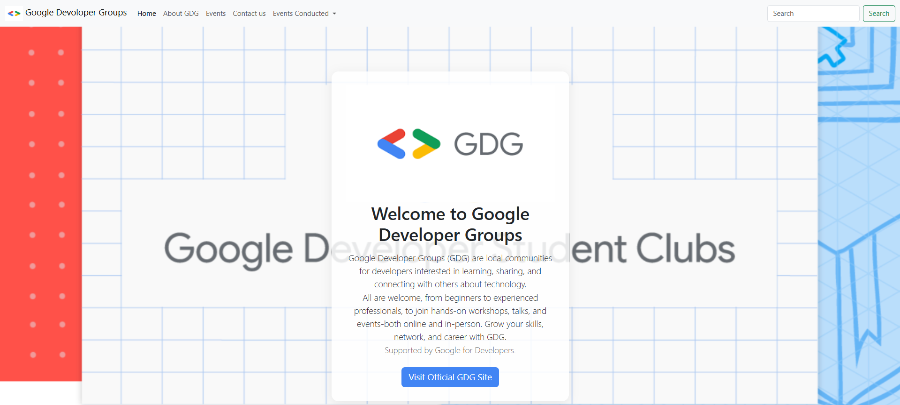

# GDG-Competition 🚀

## 📌 Project Overview
**GDG-Competition** is a web development project created as part of a **Web Developer Bootcamp** conducted by the **Google Developer Group (GDG) Student Chapter**.  
This project is my attempt at designing and building a responsive **Google Developer Clubs (GDC) website**, focusing on clean UI, responsiveness, and basic interactivity.

## 🎯 Objective
The main goal of this project was to:
- Practice front-end web development skills  
- Understand responsive design principles  
- Implement a real-world inspired website layout  
- Gain hands-on experience during the GDG bootcamp  

## 🛠️ Technologies Used
- **HTML** – Structure of the website  
- **CSS** – Styling and layout  
- **JavaScript** – Basic interactivity  
- **Bootstrap** – Responsive design and components  

## 💻 Tools
- **VS Code** – Code editor used for development  

## 📷 Final Output
Below are screenshots of the final output of the project:

## 📂 Project Status
✅ Completed  
This project was developed as part of a learning experience and serves as a demonstration of my front-end development skills.

## 🙌 Acknowledgements
- Google Developer Group (GDG) Student Chapter  
- Web Developer Bootcamp organizers  

---

⭐ If you like this project, feel free to star the repository!
